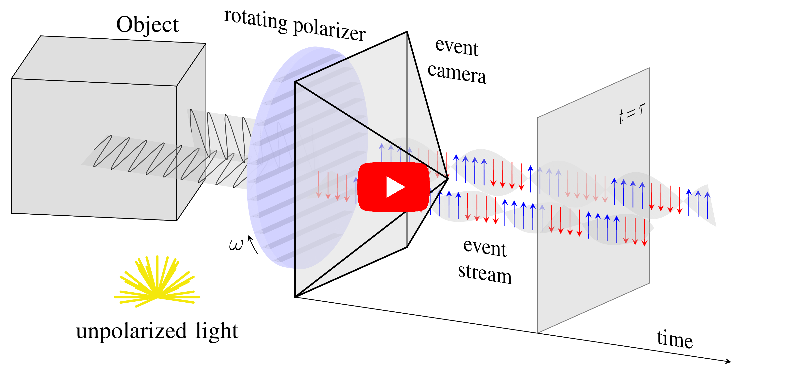

# ESFP: Event-based Shape from Polarization

### Video (click on the image)
[](https://youtu.be/sF3Ue2Zkpec)
## Installation

Install metavision from [here](https://docs.prophesee.ai/3.1.2/installation/index.html)
```bash
conda create -y -n esfp
conda activate esfp
conda install -y -c anaconda numpy scipy
conda install -y -c conda-forge opencv tqdm matplotlib pybind11 h5py blosc-hdf5-plugin
pip install --no-cache-dir -r training_code/requirements.txt

```
## Dataset
Download the dataset from rpg.ifi.uzh.ch/esfp.html
To download the mistuba dataset and real dataset use the following links respectively:

```
wget https://download.ifi.uzh.ch/rpg/ESfP/mitsuba_dataset.zip
wget https://download.ifi.uzh.ch/rpg/ESfP/realworld_dataset.zip
```

## Train
To train the network to predict surface normals, use the following training scripts:
`bash training_code/scripts/train_events_esfp_syn.sh`

## Citation
This is the code for the 2023 CVPR paper Event-based Shape from Polarization by Manasi Muglikar, Leonard Bauersfeld, Diederik Moeys and Davide Scaramuzza.

A pdf of the paper is available [here](https://rpg.ifi.uzh.ch/docs/CVPR23_Muglikar.pdf). If you use this code in an academic context, please cite the following work:

```@InProceedings{Muglikar23CVPR,
  author = {Manasi Muglikar and Leonard Bauersfeld and Diederik Moeys and Davide Scaramuzza},
  title = {Event-based Shape from Polarization},
  booktitle = {IEEE / CVF Computer Vision and Pattern Recognition Conference (CVPR)},
  month = {Jun},
  year = {2023}
}
```